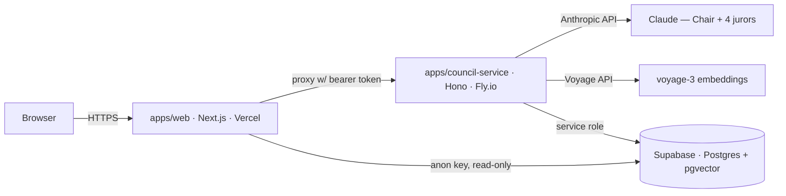

# 01 — Architecture & Repo Layout

## Deployment topology



- **`apps/web`** (Vercel): intake, live courtroom, replay pages. Never holds the service bearer token in the browser — all council-service calls go through a Next.js route handler proxy.
- **`apps/council-service`** (Fly.io, fallback Railway — whichever deploys faster on day one, documented here): runs deliberations. Lives outside serverless because sessions stream for 60–90s. Single small instance is enough; sessions are independent.
- **Supabase**: persona library (pgvector), session persistence, event replay log. Frontend reads *finished* sessions directly with the anon key + RLS read-only policies; all writes go through the service role key held only by the council service.
- **Model calls**: Anthropic SDK from the council service only. No model calls from the frontend.

## Monorepo layout (pnpm workspace)

```
jury/
├── pnpm-workspace.yaml
├── package.json
├── .env.example                  # every env var, documented (see spec 09)
├── apps/
│   ├── web/                      # P3 — Next.js 15, Tailwind, Framer Motion
│   │   ├── app/
│   │   │   ├── page.tsx          # intake ("file your case")
│   │   │   ├── session/[id]/     # live courtroom (SSE)
│   │   │   ├── replay/[id]/      # finished-session replay (reads Supabase)
│   │   │   ├── dev/replay/       # fixture replay harness (P3 task 3)
│   │   │   └── api/sessions/     # proxy routes → council-service (holds token)
│   │   ├── components/
│   │   │   ├── courtroom/        # Bench, JuryBox, JurorSeat, SpeechBubble, ToolChip
│   │   │   ├── verdict/          # Gavel, VoteSplit, DissentSpotlight, BriefExport
│   │   │   └── intake/
│   │   ├── lib/
│   │   │   ├── sse-client.ts     # reconnect + Last-Event-ID resume
│   │   │   └── session-store.ts  # single reducer: contract events → courtroom state
│   │   └── public/characters/    # sprite assets: <species>/<state>.png
│   └── council-service/          # P4 scaffold, P1 chair, P2 casting
│       ├── src/
│       │   ├── index.ts          # Hono app: POST /sessions, GET /sessions/:id/stream
│       │   ├── auth.ts           # bearer token check
│       │   ├── chair/            # P1
│       │   │   ├── state-machine.ts
│       │   │   ├── orchestrator.ts
│       │   │   └── prompts/      # intake.ts, brief.ts, statement.ts, rebuttal.ts, verdict.ts
│       │   ├── casting/          # P2
│       │   │   ├── retrieve.ts   # pgvector top-K
│       │   │   ├── mmr.ts        # pure function, unit-tested
│       │   │   └── diversity.ts  # score + baseline
│       │   ├── tools/            # P4 — web-search.ts, calculator.ts (spec 06)
│       │   ├── events/           # emitter.ts, persist.ts, replay.ts
│       │   └── db/               # supabase client + typed queries
│       ├── test/
│       └── fly.toml
├── packages/
│   └── contract/                 # P4 pen, all sign — THE hour-0 deliverable
│       └── src/                  # events.ts, stance.ts, verdict.ts, persona.ts, phases.ts (zod)
├── seed/                         # P2 — offline, one-time
│   ├── generate-personas.ts      # LLM generation w/ quality rubric
│   ├── embed-personas.ts         # voyage-3 batch
│   └── load-supabase.ts
├── fixtures/
│   └── golden-session.jsonl      # recorded event streams (P3 dev + demo mode)
├── eval/                         # P1 — spec 08
│   ├── benchmark-dilemmas.json   # fixed 20-dilemma set
│   ├── run-eval.ts
│   └── rubrics/
├── supabase/
│   └── migrations/               # P4 applies, P2 co-designs personas table
├── specs/                        # these documents
└── tasks/                        # per-person breakdowns
```

## Rules that keep four people unblocked

1. **Ownership is by directory.** P1 = `chair/` + `eval/`; P2 = `casting/` + `seed/`; P3 = `apps/web/`; P4 = everything else. PRs touching someone else's directory need their review.
2. **`packages/contract` is the only shared code.** Changing it after hour 0 requires all-four sign-off (see specs/README change protocol).
3. **Frontend consumes fixtures, not the backend,** until the hour-12 checkpoint.
4. **No cross-imports between `chair/`, `casting/`, `tools/`** — they meet only through the interfaces in spec 04/05/06 and the contract types.
